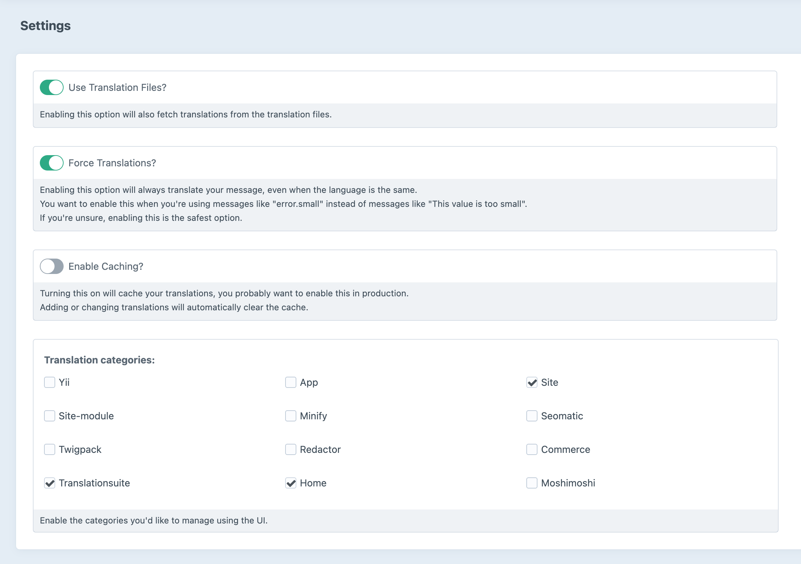
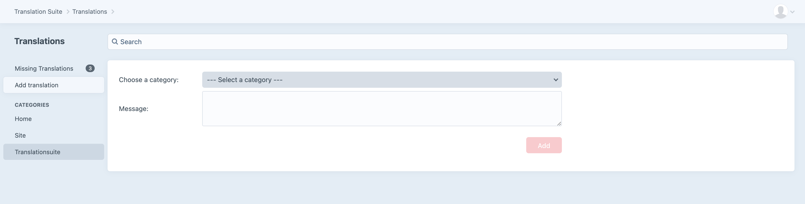
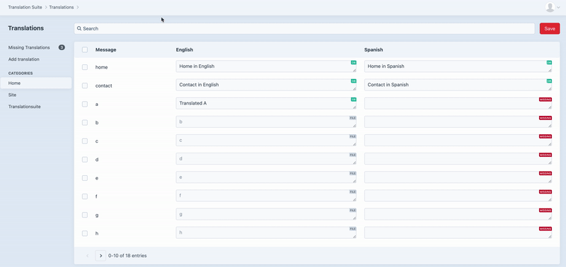
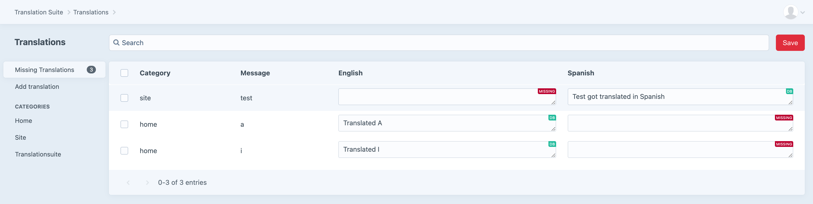
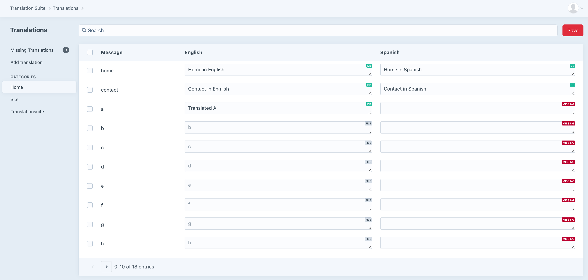

# Translation Suite plugin for Craft CMS 3.x

Translation Suite allows developers to provide static translations during development while allowing
the user to manage these translations through the use of a user interface. 

## Requirements

This plugin requires Craft CMS 3.0.0-beta.23 or later.

## Installation

To install the plugin, follow these instructions.

1. Open your terminal and go to your Craft project:

        cd /path/to/project

2. Then tell Composer to load the plugin:

        composer require moshimoshi/craft-translationsuite

3. In the Control Panel, go to Settings → Plugins and click the “Install” button for Translationsuite.

## Translation Suite Overview

Translation Suite is a plugin meant to help you with static translations. It allows you to enter translations using
the traditional PHP files, but it also allows you to manage these translations using the UI. This way developers can
provide translations during development while allowing the customer to overwrite these changes.

Currently, preparations are being made to allow you to export your translations (files, db, combined) to csv or excel.
This way you can easily share translations with 3rd parties for translations. The import function is also on its 
way to allow users to import the translations.

## Configuring Translation Suite
Configuring Translation Suite is straight forward. Every setting available is explained
in detail. In most cases you want to enable all the switches and select which categories 
you want to manage. 

**Note:** Enabling categories like Yii, App etc will not load the translations. It will
allow you to add translations to these categories if you'd need this.

## Using Translation Suite
Translation suite provides a UI for translations but also for manually adding a translation.
Usually you won't need to manually add translations here but you can.

### Quick search
Easily search through your translations on message or translation from a file or from the database.
This way finding a specific translation is a breeze.

### Missing translations
When translations are missing when they are requested it will automatically pick up these translations and add
them for you. You can do this by refreshing the page, if the translation is not defined in a translation file
it will show up in your missing translations.

### Easily see the source of the translation
Since translations can come from multiple sources (files or the database) we've added some labels
to the fields showing where the translation is coming from. If no translation is found it will also label this.

## Translationsuite Roadmap

Some things to do, and ideas for potential features:

* Export to csv, excel
* Import from csv, excel
* Exports to PHP file to overwrite static translations, handy when you need to sync translations between environments.
* GraphQL Support
* Variable to inject translation in the window object.
* Translate another translation based on an existing translation using third parties like Google translate, yandex, etc.

Huge thanks to [nystudio107](https://nystudio107.com) for all the great blogs, podcasts and so much more 🙇‍♂️

Brought to you by [moshimoshi](https://moshimoshi.be)
